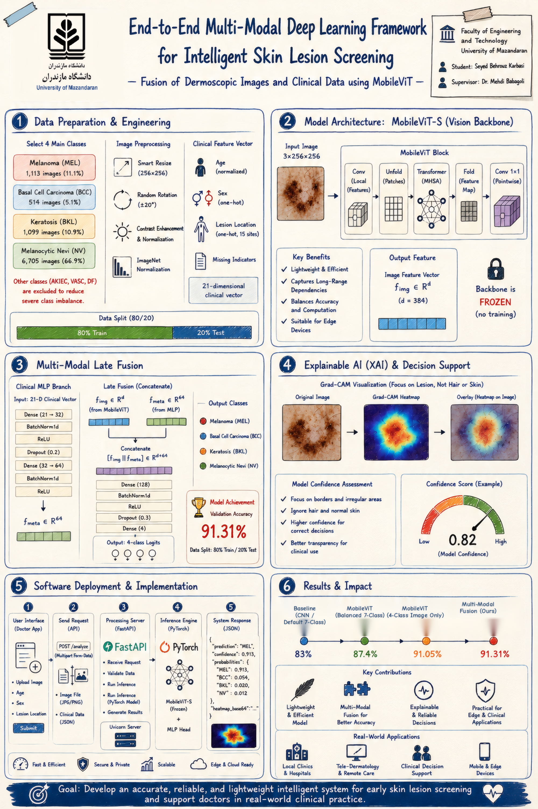

# End-to-End Multi-Modal Deep Learning Framework for Intelligent Skin Lesion Screening
### Fusion of Dermoscopic Images and Clinical Data using MobileViT



## 📌 Project Overview
This repository contains the source code, training pipelines, and deployment interfaces for an end-to-end, lightweight, and explainable multi-modal deep learning framework designed for early screening of skin lesions. 

The framework fuses **Dermoscopic Images** with **21-Dimensional Patient Clinical Metadata** (Age, Sex, Anatomical Site) using a Late Fusion strategy on top of a hybrid **MobileViT-S** backbone.

## 🚀 Key Achievements & Results
- **Lightweight Architecture:** ~60MB footprint suitable for offline edge and mobile deployment.
- **Explainability (XAI):** Integrated Grad-CAM highlighting relevant lesion boundaries while ignoring artifacts.
- **Accuracy Progression:**
  - **Baseline (CNN / 7-Class):** 83.0%
  - **MobileViT (Balanced 7-Class):** 87.4%
  - **MobileViT (4-Class Image Only):** 91.05%
  - **Multi-Modal Fusion (Ours):** **91.31%**

## 📂 Classes
The model focuses on 4 critical diagnostic categories:
1. **MEL:** Melanoma (Malignant)
2. **BCC:** Basal Cell Carcinoma
3. **BKL:** Benign Keratosis-like Lesions
4. **NV:** Melanocytic Nevi (Benign)

## 📦 Dataset & Weights
- **Dataset:** Built upon the benchmark [HAM10000 Dataset](https://www.kaggle.com/datasets/kmader/skin-cancer-mnist-ham10000).
- **Model Checkpoints:** Pretrained `.pth` models can be downloaded via the repository Releases.

## 🛠️ Installation & Quick Run
```bash
# Clone the repository
git clone [https://github.com/Farnam03/MultiModal-Skin-Lesion-MobileViT.git](https://github.com/Farnam03/MultiModal-Skin-Lesion-MobileViT.git)
cd MultiModal-Skin-Lesion-MobileViT

# Install dependencies
pip install -r requirements.txt

# Run local offline interface
python app.py
